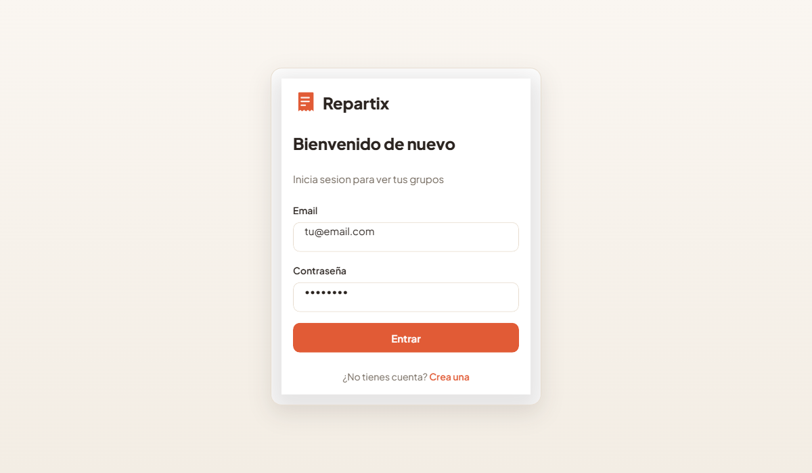
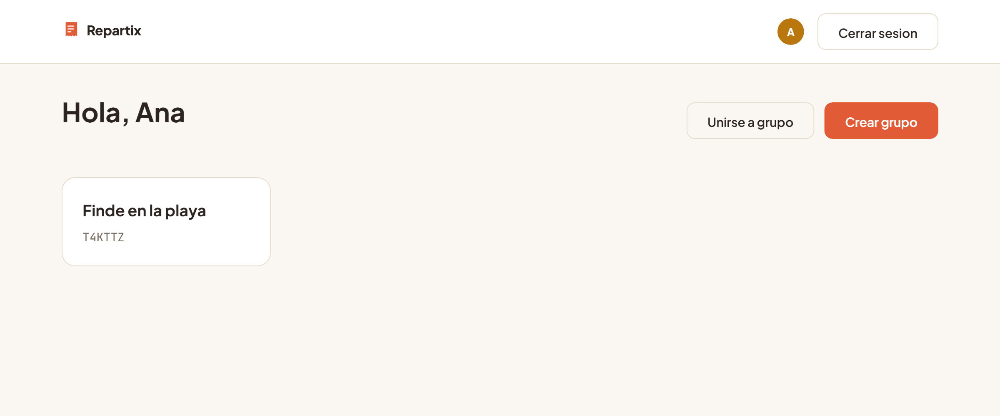
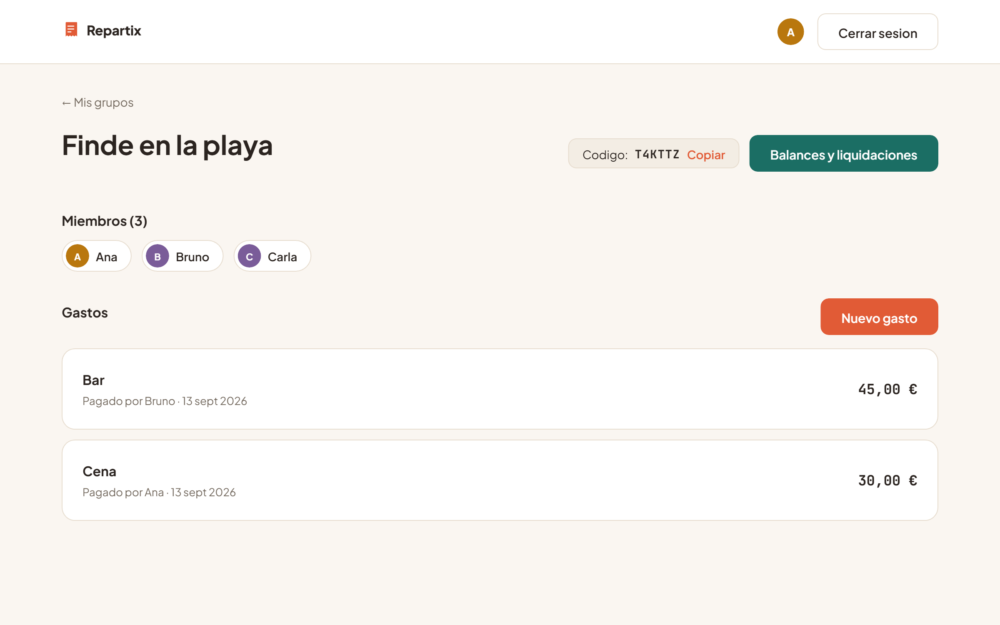
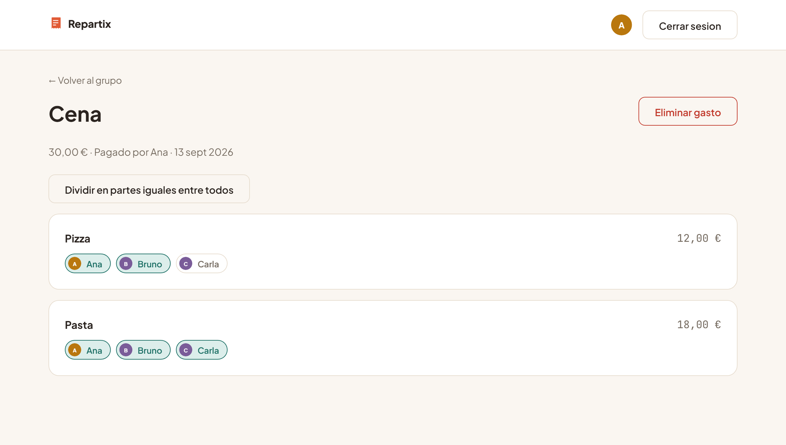
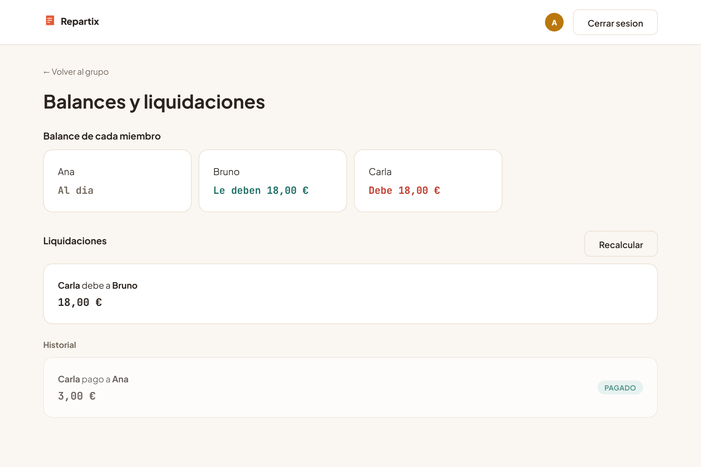

<div align="center">

# Repartix

**Divide gastos de grupo a partir de una foto del ticket.**
Una IA de visión extrae los artículos y precios, cada persona marca qué consumió, y la app calcula automáticamente quién le debe a quién — con simplificación de deudas.

[](LICENSE)


🇬🇧 [Read this in English](README.md)

</div>

---

## Por qué existe

Repartir la cuenta de un viaje o una cena en grupo casi siempre acaba en una hoja de cálculo improvisada o en un "ya me lo das luego" que nadie hace. Repartix automatiza las dos partes tediosas: **leer el ticket** (con IA de visión) y **calcular quién paga a quién** (con un algoritmo de simplificación de deudas), para que lo único que quede por hacer sea marcar cada artículo como propio.

Es una pieza de portfolio técnico construida como una aplicación real, no una demo de un solo camino feliz: autenticación con JWT y contraseñas cifradas, base de datos relacional con transacciones, validación de entrada en cada endpoint, control de acceso por pertenencia a grupo, y los cálculos de dinero hechos en céntimos enteros para que no se pierda un solo céntimo por redondeo.

## Capturas

<table>
<tr>
<td width="50%">

**Login**


</td>
<td width="50%">

**Tus grupos**


</td>
</tr>
<tr>
<td width="50%">

**Detalle de grupo**


</td>
<td width="50%">

**Asignar quién consumió qué**


</td>
</tr>
</table>

**Balances y liquidaciones**


## Funcionalidades

- Registro e inicio de sesión con contraseña cifrada (bcrypt) y sesión por JWT
- Crear un grupo o unirse a uno existente con un código de invitación de 6 caracteres
- Subir una foto del ticket → una IA de visión (Gemini) extrae los artículos y el importe total, editables antes de guardar
- Cada miembro marca qué artículos consumió, o reparte un gasto completo a partes iguales con un clic
- Motor de cálculo de deudas: balance neto por persona, con impuestos y propina prorrateados proporcionalmente
- Simplificación de deudas: si A debe a B y B debe a C, se reduce a que A le pague directamente a C, minimizando el número de pagos
- Historial de gastos del grupo, con la foto del ticket enlazada
- Marcar una liquidación como pagada (solo lo pueden hacer las dos personas implicadas en esa deuda)

## Stack

| Capa | Tecnología | Por qué |
|---|---|---|
| Backend | Node.js + Express | API REST sencilla, sin sobre-ingeniería para el tamaño del proyecto |
| Base de datos | SQLite (better-sqlite3) → Postgres en producción | Cero configuración en desarrollo, migraciones con `ALTER TABLE` para no perder datos |
| Auth | JWT + bcrypt | Igual patrón que usaría en un backend en producción |
| Validación | Zod | Esquemas explícitos en cada endpoint, mensajes de error consistentes |
| Frontend | React + Vite | Sin frameworks de estilos: sistema de diseño propio con CSS Modules |
| IA de visión | Google Gemini (`gemini-2.5-flash`) | Extracción estructurada (`responseSchema`) de ítems y precios desde la imagen |
| Imágenes | Cloudinary | Almacenamiento persistente entre despliegues (no depende del disco del servidor) |

## Cómo calcula quién debe a quién

1. **Por cada gasto**, quien pagó se anota el importe completo a favor, y ese mismo importe (con impuestos o propina ya prorrateados proporcionalmente entre los artículos) se reparte entre las personas asignadas a cada artículo.
2. Todo el reparto se hace **en céntimos enteros** con el método del resto mayor, para que la suma de lo cobrado y lo repartido cuadre siempre exacta — sin fugas de un céntimo por errores de redondeo con `float`.
3. Con el balance neto de cada persona, un **algoritmo greedy** empareja en cada paso al mayor deudor con el mayor acreedor, minimizando cuántas transferencias hacen falta para saldar todas las deudas del grupo.
4. Las liquidaciones ya marcadas como pagadas se recuerdan: si se añade un gasto nuevo, no se vuelve a pedir un pago que ya se hizo.

## Puesta en marcha

Requiere Node.js 20 o superior.

### 1. Backend

```bash
cd backend
npm install
cp .env.example .env
```

Edita `backend/.env` y pon un valor aleatorio largo en `JWT_SECRET`:

```bash
node -e "console.log(require('crypto').randomBytes(48).toString('hex'))"
```

```bash
npm run migrate   # crea la base de datos SQLite y sus tablas
npm run dev        # http://localhost:3001
```

Para correr los tests de la lógica de cálculo de deudas (Vitest):

```bash
npm test
```

### 2. Frontend

En otra terminal:

```bash
cd frontend
npm install
cp .env.example .env
npm run dev         # http://localhost:5173
```

Con esto la aplicación funciona por completo: registro, login, grupos, gastos y liquidaciones. La única pieza que requiere configuración adicional es el escaneo de tickets con IA (opcional, ver abajo) — sin ella, todo lo demás funciona igual y los gastos se introducen a mano.

### 3. Activar el escaneo de tickets con IA (opcional)

Sin estas credenciales, el botón "Escanear ticket con IA" muestra un aviso y el formulario se rellena a mano con normalidad — el resto de la app no se ve afectado.

| Variable | Dónde conseguirla |
|---|---|
| `GEMINI_API_KEY` | [Google AI Studio](https://aistudio.google.com/apikey) — gratis, sin tarjeta |
| `CLOUDINARY_CLOUD_NAME`, `CLOUDINARY_API_KEY`, `CLOUDINARY_API_SECRET` | [Cloudinary](https://cloudinary.com/users/register/free) — plan gratuito, están en el Dashboard tras registrarte |

## Despliegue

El backend habla con la base de datos a través de [Knex](https://knexjs.org/), no directamente con el driver de SQLite: el mismo código de `services/` funciona sin cambios contra SQLite o Postgres, según si la variable `DATABASE_URL` está definida.

```
DATABASE_URL vacía   → SQLite local (backend/data/repartix.sqlite)
DATABASE_URL definida → Postgres (esa cadena de conexión)
```

Verificado con dos suites de tests: una contra SQLite real (la misma que corre en desarrollo) y otra contra un motor compatible con Postgres en memoria ([pg-mem](https://github.com/oguimbal/pg-mem), ya que este entorno no tenía Docker a mano para levantar un Postgres real) — ambas ejercitan el mismo escenario de gastos y balances con resultados idénticos. Aun así, conviene probar el registro/login nada más desplegar, como primera comprobación contra el Postgres real de producción.

### Backend en Railway

1. Crea un proyecto en Railway y conéctalo a este repo (carpeta `backend/`).
2. Añade el plugin de **Postgres** de Railway — genera `DATABASE_URL` automáticamente, no hay que escribirla a mano.
3. Configura el resto de variables de entorno del proyecto (mismas claves que `backend/.env.example`): `JWT_SECRET`, `FRONTEND_URL` (la URL pública que te dé Vercel), y opcionalmente `GEMINI_API_KEY`/`CLOUDINARY_*`.
4. Comando de arranque: `npm start`. Las migraciones se aplican solas al arrancar (`migrate()` corre antes de levantar el servidor), igual que en local.

### Frontend en Vercel

1. Importa este repo en Vercel, con `frontend/` como carpeta raíz del proyecto.
2. Variable de entorno: `VITE_API_URL` apuntando a la URL pública del backend en Railway (por ejemplo `https://tu-backend.up.railway.app/api`).

### CORS

En desarrollo, sin `FRONTEND_URL` definida, el backend admite peticiones de cualquier origen (igual que siempre). En producción, definir `FRONTEND_URL` con la URL de Vercel restringe el CORS a ese origen — evita que otra web cualquiera pueda llamar a tu API con la sesión de un usuario.

## Estructura

```
backend/
  src/
    routes/          endpoints Express, agrupados por recurso
    controllers/     validan la entrada y orquestan la respuesta
    services/        logica de negocio y acceso a datos (SQL)
    middleware/      auth, pertenencia a grupo, subida de imagenes
    validators/      esquemas Zod por endpoint
    db/              conexion Knex (SQLite/Postgres) y migraciones
frontend/
  src/
    pages/           una pantalla por ruta
    components/
      ui/            Button, Input, Card, Modal, Avatar... (sistema de diseno)
      layout/        AuthLayout, AppShell
      routing/       guardas de ruta (protegida / solo invitados)
    api/             un modulo por recurso, todos sobre un cliente fetch comun
    context/         estado de autenticacion global
docs/screenshots/    capturas usadas en este README
```

Cada carpeta (`backend/`, `frontend/`) tiene su propio `package.json` y se ejecuta de forma independiente.

## Licencia

Distribuido bajo la [licencia MIT](LICENSE): puedes usar, copiar, modificar y distribuir el código libremente, incluso con fines comerciales, siempre que se mantenga el aviso de copyright.
